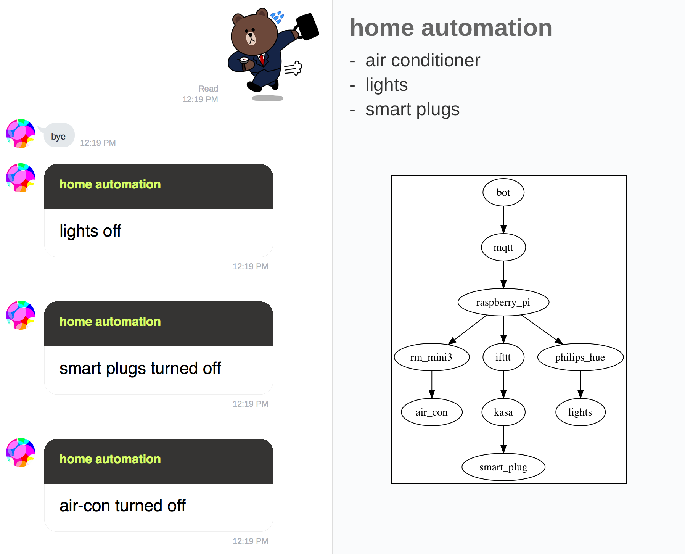
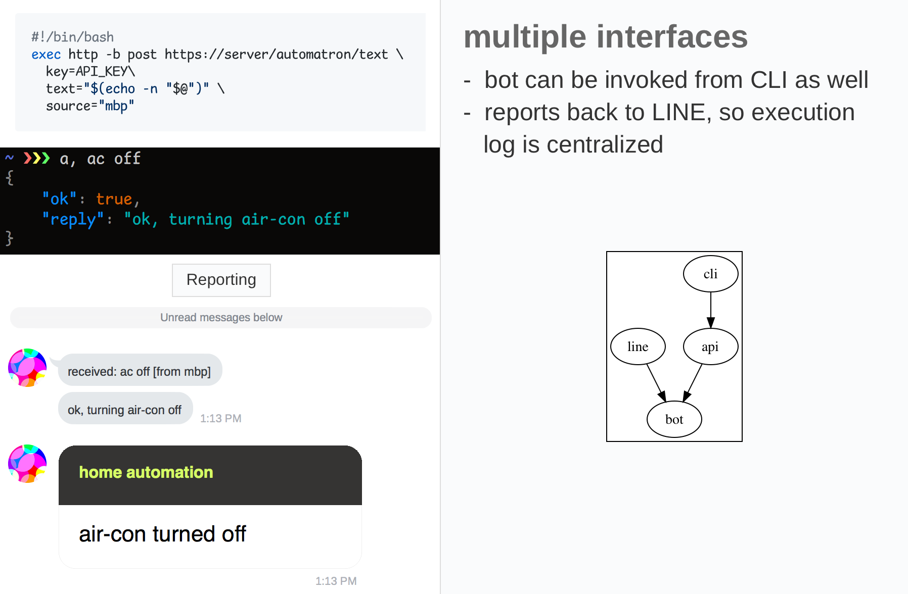

# automatron

This is the code of my LINE bot for personal use.

## features

### home automation

I have a Raspberry Pi set up which can [control lights](https://github.com/dtinth/hue.sh), [air conditioner](https://medium.com/@dtinth/remotely-turning-on-my-air-conditioner-through-google-assistant-1a1441471e9d), and [smart plugs](https://ifttt.com/services/kasa). It receives commands via [CloudMQTT](https://www.cloudmqtt.com/) and performs the action, then reports back to automatron via [its API](#cli-api).

### expense tracking

Simple expense tracking by typing in the amount + category. Example: 50f means ฿50 for food. Data is sent [to IFTTT, which records the expense in Google Sheets](https://ifttt.com/services/google_sheets).

### transaction aggregation

I [set up IFTTT to read SMS messages](https://ifttt.com/services/android_messages) and send it to automatron. It then uses [transaction-parser-th](https://github.com/dtinth/transaction-parser-th) to parse SMS message and extract transaction information. It is then sent to me as a [flex message](https://developers.line.me/en/docs/messaging-api/using-flex-messages/).

### livescript

[LiveScript](https://livescript.net/) interpreter is included, which allows me to do some quick calculations.

### cli / api

`POST /text` sends a text command to automatron. This is equivalent to sending a text message through LINE. This allows me to create a CLI tool that lets me talk to automatron from my terminal.

`POST /post` sends a message to my LINE account directly. This allows the [home automation](#home-automation) scripts to report back to me whenever the script is invoked.
